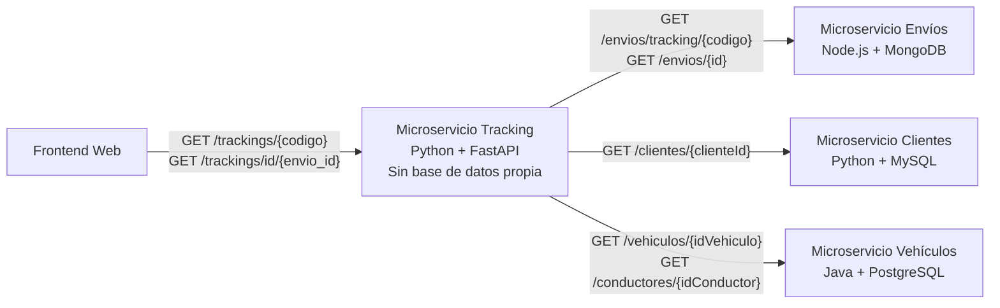

# Microservicio de Tracking — Sistema de Logística y Entregas

## Descripción del microservicio

El **Microservicio de Tracking** es una API REST responsable de consolidar la información necesaria para realizar el seguimiento de un envío dentro del sistema de logística y entregas.

A diferencia de los microservicios de Clientes, Vehículos y Envíos, **Tracking no posee una base de datos propia**. Su función es consumir las APIs REST de los otros microservicios y construir una respuesta unificada con la información del envío, el destinatario, la dirección de entrega, el vehículo, el conductor y los productos transportados.

El servicio está desarrollado con **Python + FastAPI** y realiza las consultas HTTP de manera asíncrona mediante **HTTPX**.

Para obtener el detalle de seguimiento:

- **Envíos** proporciona el estado del envío, código de seguimiento, pedido, fechas, productos y los snapshots históricos de la dirección, vehículo y conductor.
- **Clientes** proporciona los datos actuales del destinatario.
- **Vehículos** proporciona información actual del vehículo y del conductor asignados.

La integración entre servicios se realiza exclusivamente mediante los endpoints REST publicados por cada microservicio. Tracking **no accede directamente a MySQL, PostgreSQL ni MongoDB**.

Cuando el vehículo o conductor todavía existen en el microservicio de Vehículos, Tracking combina el snapshot almacenado en Envíos con la información operativa actual. Si alguno ya no existe, conserva la información histórica almacenada en el envío.

---

## Diagrama de integración

Debido a que Tracking no posee base de datos propia, esta sección reemplaza el diagrama Entidad/Relación por un **diagrama de integración entre microservicios**.



### Flujo de consulta

1. El frontend solicita el tracking utilizando un código de seguimiento o el identificador interno de un envío.
2. Tracking consulta al **Microservicio de Envíos** para obtener la información principal y los snapshots históricos.
3. Con el `clienteId`, consulta al **Microservicio de Clientes** para obtener los datos del destinatario.
4. Con los identificadores almacenados en el envío, consulta al **Microservicio de Vehículos** para obtener el estado actual del vehículo y del conductor.
5. Tracking consolida la información y devuelve una única respuesta al frontend.

Las consultas a Clientes, Vehículos y Conductor se ejecutan de forma asíncrona para reducir el tiempo total de respuesta.

---

## Principales endpoints

### Tracking

| Método | Endpoint | Descripción |
|---|---|---|
| `GET` | `/trackings/{codigo}` | Obtiene el detalle completo de un envío mediante su código de seguimiento. |
| `GET` | `/trackings/id/{envio_id}` | Obtiene el detalle completo de un envío mediante su identificador interno. |

### Estado del servicio

| Método | Endpoint | Descripción |
|---|---|---|
| `GET` | `/` | Verifica que el microservicio se encuentre operativo. |

### APIs consumidas internamente

Tracking utiliza los siguientes endpoints de los demás microservicios:

| Microservicio | Endpoint consumido | Finalidad |
|---|---|---|
| **Envíos** | `GET /envios/tracking/{codigo}` | Obtener el envío mediante su código de seguimiento. |
| **Envíos** | `GET /envios/{id}` | Obtener el envío mediante su identificador interno. |
| **Clientes** | `GET /clientes/{clienteId}` | Obtener los datos del destinatario. |
| **Vehículos** | `GET /vehiculos/{idVehiculo}` | Obtener información actual del vehículo asignado. |
| **Vehículos** | `GET /conductores/{idConductor}` | Obtener información actual del conductor asignado. |

### Respuesta consolidada

La respuesta de Tracking contiene información proveniente de los tres microservicios:

```json
{
  "codigoSeguimiento": "LOG-10E2FE6C",
  "pedidoId": "PED-PRUEBA-001",
  "estado": "ENTREGADO",
  "fechaCreacion": "2026-09-19T17:35:36Z",
  "fechaActualizacion": "2026-09-19T20:20:19Z",
  "cliente": {
    "id": 1,
    "nombre": "Nombre",
    "apellido": "Apellido",
    "email": "cliente@example.com",
    "telefono": "+51..."
  },
  "direccionEntrega": {
    "calle": "Dirección de entrega",
    "distrito": "Distrito",
    "ciudad": "Lima",
    "codigoPostal": "00000",
    "referencia": "Referencia"
  },
  "vehiculoAsignado": {
    "idVehiculo": 1,
    "placa": "ABC123",
    "tipo": "FURGONETA",
    "marca": "Marca",
    "modelo": "Modelo",
    "estado": "DISPONIBLE",
    "capacidadKg": 1000
  },
  "conductorAsignado": {
    "idConductor": 1,
    "nombre": "Nombre",
    "apellido": "Apellido",
    "dni": "00000000",
    "turno": "TARDE",
    "activo": true,
    "telefono": "+51..."
  },
  "items": [
    {
      "sku": "SKU-001",
      "descripcion": "Producto",
      "cantidad": 1,
      "pesoKg": 2.5
    }
  ]
}
```

La documentación interactiva de la API está disponible en:

- **Swagger UI:** `/docs`
- **ReDoc:** `/redoc`

---

## Tecnologías

| Tecnología | Uso |
|---|---|
| **Python 3.11** | Lenguaje principal del microservicio. |
| **FastAPI** | Implementación y exposición de la API REST. |
| **HTTPX** | Consumo asíncrono de los microservicios de Clientes, Envíos y Vehículos. |
| **Pydantic** | Validación y serialización de la respuesta consolidada de Tracking. |
| **Uvicorn** | Servidor ASGI utilizado para ejecutar FastAPI. |
| **Swagger / OpenAPI** | Documentación interactiva de los endpoints. |
| **CORS** | Control de los orígenes autorizados para consumir la API. |
| **Docker** | Empaquetado y ejecución del microservicio en contenedores. |

---

## Documentación Docker

El microservicio está preparado para ejecutarse dentro de un contenedor Docker utilizando una imagen basada en **Python 3.11 Slim**.

Tracking no requiere un contenedor de base de datos propio. Para funcionar correctamente, debe poder comunicarse mediante HTTP con los microservicios de Clientes, Envíos y Vehículos.

### 1. Variables de entorno

Crear un archivo `.env` a partir de `.env.example`:

```env
CLIENTES_SERVICE_URL=http://ms-clients:8000
ENVIOS_SERVICE_URL=http://ms-shipments:3000
VEHICULOS_SERVICE_URL=http://ms-vehicles:8080
CORS_ALLOWED_ORIGINS=*
```

### Variables principales

| Variable | Descripción |
|---|---|
| `CLIENTES_SERVICE_URL` | URL base del microservicio de Clientes. |
| `ENVIOS_SERVICE_URL` | URL base del microservicio de Envíos. |
| `VEHICULOS_SERVICE_URL` | URL base del microservicio de Vehículos. |
| `CORS_ALLOWED_ORIGINS` | Orígenes autorizados para consumir la API. |

Las URLs deben adaptarse al entorno donde se despliegue el sistema. Si los contenedores comparten una misma red Docker, pueden utilizarse los nombres de servicio. En un despliegue distribuido deben emplearse las direcciones internas correspondientes.

### 2. Construir la imagen

Desde la raíz del repositorio:

```bash
docker build -t svc-tracking .
```

### 3. Ejecutar el contenedor

```bash
docker run -d \
  --name ms-tracking \
  --env-file .env \
  -p 8004:8000 \
  svc-tracking
```

El puerto `8000` corresponde al puerto interno del contenedor y `8004` al puerto utilizado para acceder al servicio desde el host.

### 4. Verificar el servicio

API:

```text
http://localhost:8004/
```

Swagger UI:

```text
http://localhost:8004/docs
```

ReDoc:

```text
http://localhost:8004/redoc
```

### 5. Dependencias necesarias

Para probar Tracking en local, los microservicios que consume deben encontrarse disponibles:

```text
Clientes  -> http://localhost:8001
Vehículos -> http://localhost:8002
Envíos    -> http://localhost:8003
Tracking  -> http://localhost:8004
```

Cuando Tracking se ejecuta dentro de Docker, las URLs deben configurarse mediante las variables de entorno para que apunten a los servicios accesibles desde la red del contenedor.

### 6. Comandos útiles

Verificar el contenedor:

```bash
docker ps
```

Revisar los logs:

```bash
docker logs ms-tracking
```

Detener el contenedor:

```bash
docker stop ms-tracking
```

Eliminar el contenedor:

```bash
docker rm ms-tracking
```
